# 实验报告

## 实验目标

1. 爬虫与检索
   - 爬取指定的电影、书籍主页，解析并保存基本信息
   - 结合给定的标签信息，实现电影和书籍的检索
2. 推荐系统
   - 结合用户评价信息与社交网络，进行个性化电影、书籍推荐

## Part1

本部分提交的文件目录如下：

├─part1
│  ├─search
│  │  ├─data
│  │  │      cn_stopwords.txt	# 停用词表
│  │  │      dict_synonym.txt	# 同义词表
│  │  │      
│  │  ├─res
│  │  │      index.txt	# tag-index 索引表
│  │  │      inverted_index.txt	# 倒排索引表
│  │  │      inverted_index_compress.txt	# 压缩后的倒排表
│  │  │      tags.txt	# tag 数据集
│  │  │      
│  │  └─src
│  │          index_compress.py	# 建立压缩版倒排表
│  │          index_init.py	# 建立倒排表
│  │          search.py	# 检索
│  │          search_compress.py	# 依据压缩的倒排表检索
│  │          tags_init.py	# 生成 tag 数据集
│  │          
│  └─spider
│      ├─data
│      │      Book_id.csv	# 待爬取的书籍 id
│      │      Movie_id.csv	# 待爬取的电影 id
│      │      
│      ├─res
│      │      book.csv	# 书籍信息爬取结果
│      │      error.txt	# 404 的 id
│      │      movie.csv	# 电影的爬取结果
│      │      
│      └─src
│                book_spider.py	# 书籍爬虫
│                get_fake_ip.py	# 生成 ip 池
│                get_fake_ua.py	# 生成 ua 池
│                ip_info.txt	# ip 池
│                movie_spider.py	# 电影爬虫
│                ua_info.txt	# ua 池

### 爬虫

> 源码路径：`./part1/spider`

我们选择了网页爬取，主要使用 `requests` 库获取网页，用 `BeautifulSoup` 模块辅以 `re` 库进行内容解析，解析结果以文件形式存储。另外，用代理 IP 和生成的 user-agent 来应对反爬，用多线程并行来加速爬虫效率。

#### 反爬策略

最基本的反爬策略当然就是生成 User-Agent 伪装成浏览器发送请求，直接使用 `fake_useragent` 库即可生成，保存到 `ua_list` 列表中供选用。

但由于我们要爬取的页面数很大，而且因为用了多线程，爬取的速度很快，所以豆瓣很快就封了我们的 IP。因此，我们又写了另一个爬虫，用于爬取网上的免费 ip 代理，测试后选择可用的构建 IP 代理池，保存到 `ip_list` 列表中供选用。

每次访问网页时，随机选择一个 ua 和 ip 组合，传入 `get()` 函数请求网页，若返回的代码是 403，说明 ip 又被封了，就换个 ip 重试。

虽然成功的爬取了所有数据，但是爬完之后我主机 ip 还是被豆瓣封了，推测因为是网上的免费代理匿名性不够。

相关代码片段如下：

```python
ua_list = get_fake_ua.get_ua_pool()
ip_list = get_fake_ip.get_ip_pool()
def create_headers(self):
    ua = random.choice(ua_list)
    headers = {
        'User-Agent': ua
    }
    return headers
def create_proxies(self):
    self.ip = random.choice(ip_list)
    proxies = {
        'http': 'http://' + self.ip
    }
    return proxies
def get_html(self, url):
    headers = self.create_headers()
    proxies = self.create_proxies()
    try:
        response = requests.get(url, headers=headers, proxies=proxies)
        except:
            return None
        return [response.text, response.status_code]
```

#### 解析方法

为了方便保存结果，先设计一本书籍的数据结构如下：

```python
book = {
    'id': '',
    'name': '',
    'author': '',
    'date': '',
    'score': (),  # (评分，评价人数)
    'intro': '',
    'author_intro': '',
    'recommend': [] # 推荐书籍的 id 列表
}
```

对于网页内容的解析，第一版我们直接使用 `re` 库进行正则匹配，但效果不好，因为网页源码格式不太统一，正则表达式不是很好写，经常匹配不到或匹配错误，而且解析速度比较慢。

之后我们换用了 `BeautifulSoup` 进行解析，可以很快速方便的分离标签和文本内容，然后通过 `soup.find()` 函数来查找相应标签对应的内容。  `BeautifulSoup` 是一个解析器，可以将网页解析为树状结构，可以通过标签查找到对应内容，省去了我们编写正则表达式的麻烦。对解析出的文本，使用简单正则表达式就可以提取出我们需要的内容，然后保存到文件中即可。

相关代码片段如下：

```python
def parse_html(self, html, book_id):
    # beautifulsoup 解析
    soup = BeautifulSoup(html, 'html.parser')
    # 书名
    self.book['id'] = book_id
    name = soup.find('span', attrs={'property': 'v:itemreviewed'})
    if not name:
        return
    self.book['name'] = name.text
    # info
    info = soup.find('div', attrs={'id': 'info'}).text
    # print(info)
    # 从 info 中匹配出作者和出版年份
    # 可能没有
    content = re.findall('作者:(.*?)出', info, re.S)
    if not content:
        author = ' '
    else:
        author = content[0].replace('\n', ' ')
        self.book['author'] = ' '.join(author.split()) # 去除多余空格
```

##### 多线程

每次爬取一个页面效率有点低，几秒钟才能爬取一个页面，因此我们用 `threading` 库实现了多线程处理，效率提升了很多。为了防止爬取重复或遗漏，我们将 1200 条 id 分为了 12 份不重叠的组，每组由一个爬虫处理，共 12 只爬虫，理论上爬取速度最多可以提高 12 倍。另外，某些操作需要保证原子性，所以还需要通过 `Lock()` 函数加锁。

相关代码片段如下：

```python
# 多线程执行
spider = []
threads = []
for i in range(0, 12):
    spider.append(BookSpider(list[100*i : 100*i + 100]))
    threads.append(threading.Thread(target=spider[i].main))
for t in threads:
    t.start()
for t in threads:
    t.join()
print('\nCongratulations!\n')
```

### 检索

> 源码路径：`./part1/search`

我们先比较了 `jieba` 和 `hanlp` 两种分词工具的效果，然后选用了 `jieba` 进行分词，把电影或书籍的剧情简介分为了一个个关键词，然后去除同义词和停用词之后作为 tag，然后建立倒排索引表，

#### 分词

我们首先写了个测试函数 `test.py` ，分别用 `jieba` 和 `hanlp` 两种分词工具对同一个剧情简介进行分词，计算分词时间，观察分词效果。

运行结果如下：

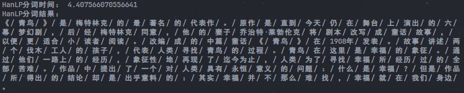

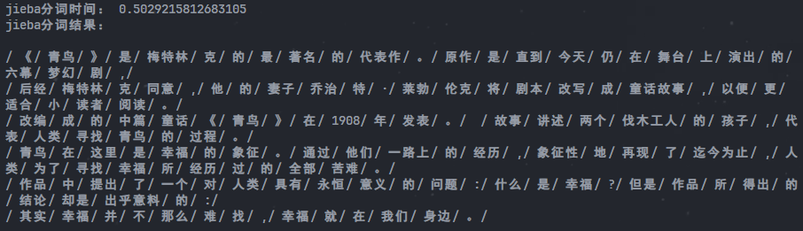

可以看出，`jieba` 分词速度明显快得多。分词效果差不多，但对于英文人名的分词，比如梅特林克和乔治特-莱勃伦克等，`hanlp` 效果明显更好。综合考虑，我们选择了 `jieba` 作为本次实验的分词工具，因为使用方便效率高。

分词之后根据停用词表和同义词表筛选即可得到 tag 数据，保存到 `tag.txt` 中。

相关代码片段如下：

```python
#预处理停用词
stopwords = []
stopwords_path = './part1/search/data/cn_stopwords.txt'
with open (stopwords_path, 'r', encoding='utf-8') as f:
    stopwords = [line.strip() for line in f.readlines()]
#预处理同义词近义词
combine_dict = {}
for line in open("./part1/search/data/dict_synonym.txt", "r", encoding='utf-8'):
    seperate_word = line.strip().split(" ")
    num = len(seperate_word)
    for i in range(2, num):
        combine_dict[seperate_word[i]] = seperate_word[1]
#获取sentence的tag
def get_tag(sentence):
    sentence = strQ2B(sentence)
    text = jieba.lcut(sentence)   
    clean_text = [word for word in text if word not in stopwords]
    combined_text = []
    for word in clean_text:
        if word in combine_dict:
            word = combine_dict[word]
        combined_text.append(word)
    exist_dict = []
    final_tags = []
    for word in combined_text:
        if not (word in exist_dict):
            exist_dict.append(word)
            final_tags.append(word) 
    return final_tags
```

#### 倒排表

有了 `tag` 数据集之后，只需要遍历一遍就可以得到索引表 `index.txt`（这里索引从 1 开始，而不是直接用 id，这样可以节省空间）。再遍历一遍索引表，对索引表的 key 和 value 反转即可得到倒排索引表 `inverted_index.txt` 。由于数据量并不是很大，所以我们这里并没有使用跳表指针（或者说是跳表指针长度为 1，实测检索速度已经很快了。

相关代码片段如下：

```python
with open('./part1/search/res/tags.txt', 'r', encoding='utf-8') as f:
    list = f.read().splitlines()
# 生成索引
index = {}
i = 1
for item in list:
    index[str(i)] = item
    i += 1
with open('./part1/search/res/index.txt', 'w', encoding='utf-8') as f:
    for key, value in index.items():
        f.write(key + ' ' + value + '\n')
# 生成倒排索引
inverted_index = {}
# 将值作为 key，将 key 作为值
for key, value in index.items():
    for tag in value.split(' '):
        if tag == '':
            continue
        if tag not in inverted_index:
            inverted_index[tag] = []
        inverted_index[tag].append(key)
with open('./part1/search/res/inverted_index.txt', 'w', encoding='utf-8') as f:
    for key, value in inverted_index.items():
        f.write(key + ' ' + ' '.join(value) + '\n')
```

#### 查询

处理 bool 表达式，因为 `or` 的优先级最低，所以可以通过 `or` 将表达式分隔为若干只含 `and` 或 `not` 的部分分别处理，然后取并集即可。对于只含 `and` 或 `not` 的部分，首先分离出 `not` 对应的 tag，然后剩下的 tag 分别检索，取交集，最后与分离出的 tag 的检索结果取差集。最后根据检索出的 id，回到 `book.csv` 文件中查找相关信息并返回给用户。

相关代码片段如下：

```python
# 获取倒排索引
inverted_index = {}
with open('./part1/search/res/inverted_index.txt', 'r', encoding='utf-8') as f:
    lines = f.read().splitlines()
    for line in lines:
        inverted_index[line.split(' ')[0]] = line.split(' ')[1:]
# 处理 and 和 not
def search_and(query):
    tags = query.split('and')
    not_list = []
    for tag in tags:
        if 'not' in tag:
            not_list.append(tag.split('not')[1].strip())
            tags.remove(tag)
    # 可能不存在
    try:
        result = set(inverted_index[tags[0].strip()])
    except:
        return set()
    for tag in tags:
        result = result & set(inverted_index[tag.strip()])
    for tag in not_list:
        result = result - set(inverted_index[tag.strip()])
    return result
# 处理 or
def search(query):
    tags = query.split('or')
    result = set()
    for tag in tags:
        result = result | search_and(tag)
    return result
```

运行结果如下图：

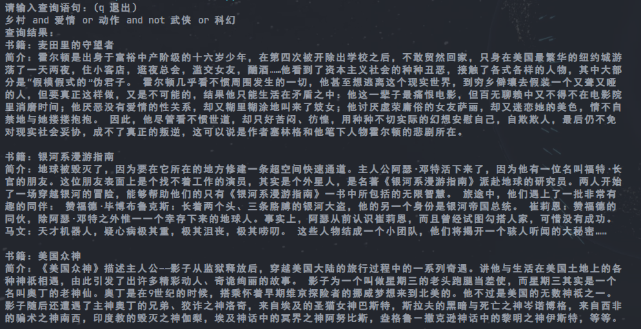

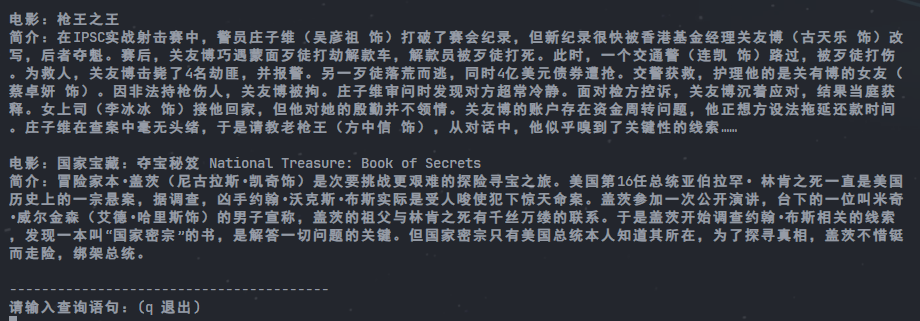

#### 压缩

对于关键词，可以将其压缩为一整个字符串，倒排表只记录对应 tag 在字符串中的起始位置（这个也可以压缩为只记录差值），对于索引，可以只记录差值。由于文件本身就不大，压缩后文件大小只减小了 100 多 kb。

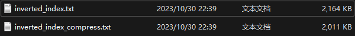

搜索时需要先解压缩，得到完整的倒排索引表，再搜索。实际上，因为这里压缩方案很简单，可以不用解压缩，直接找到对应的 tag，但是每次查询都要重复找。一开始就解压缩可以显著提高效率。

测试结果如下：

压缩前：

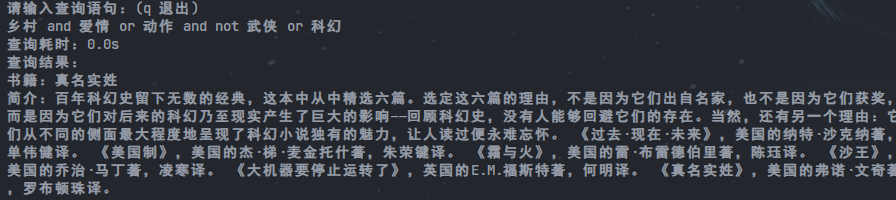

压缩后：

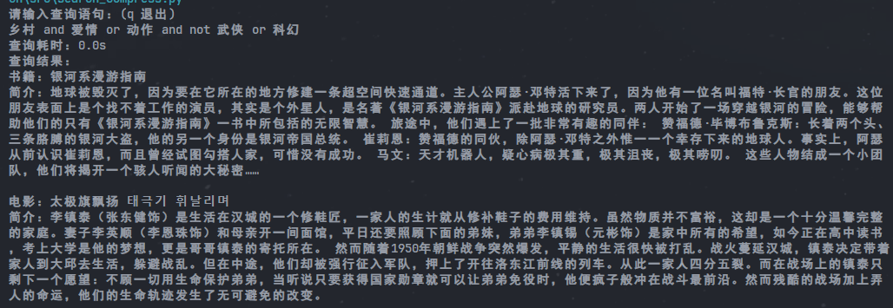

检索效率差不多，都很快。但是显然的是，压缩后检索效率肯定变低了，因为解压需要时间。

#### 检索结果

PB21111715 李宁

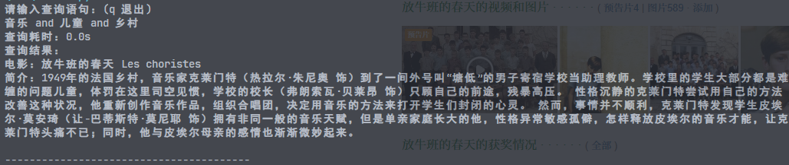

PB21111716 李乐禛

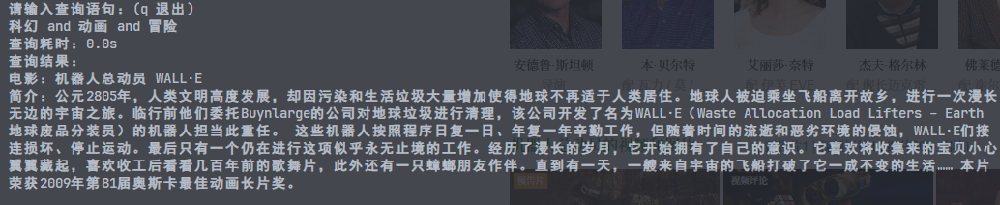

PB21111738 周子语

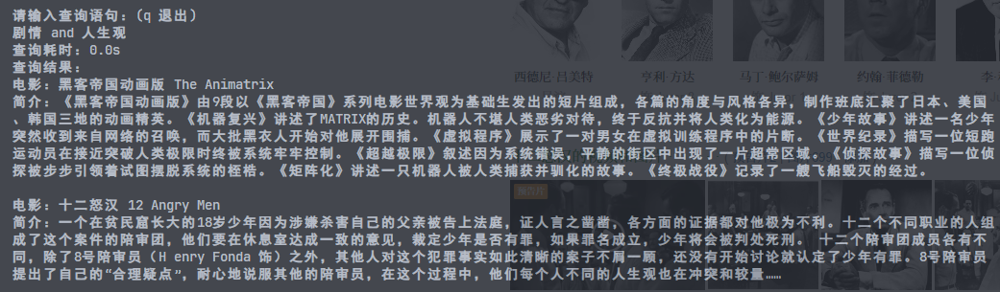

## Part2

本部分提交的文件目录如下：

part2
    ├─data
    │      movie_score.csv	# 原始评分数据
    │      selected_movie_top_1200_data_tag.csv	# 原始 Tag 数据
    │      
    ├─res
    │      selected_users.csv	# 筛选后的用户评分数据
    │      selected_tags.csv	# 筛选后的 Tag 数据
    │      tag_embedding_dict.pkl	# 保存标签嵌入
    │      
    └─src
            MF_rec.ipynb	# 基于矩阵分解的推荐系统

> 源码路径：`./part2/src`

### 准备工作

##### 环境配置

首先下载 `cuda`，网址：`https://developer.nvidia.com/cuda-toolkit-archive`，下载安装即可。

再下载 `cuDNN`，网址：`https://developer.nvidia.com/rdp/cudnn-archive`，下载下来是个压缩包，直接解压缩，能看到如下三个文件夹（bin、include、lib），这三个文件夹拷贝到 `cuda` 的目录中。

最后下载 `pytorch`，命令：`pip3 install torch torchvision torchaudio --index-url https://download.pytorch.org/whl/cu121`

然后就可以跑样例代码了，结果如下。

自选一：使用 `Bert` + `MF` 的算法：（耗时 10min）

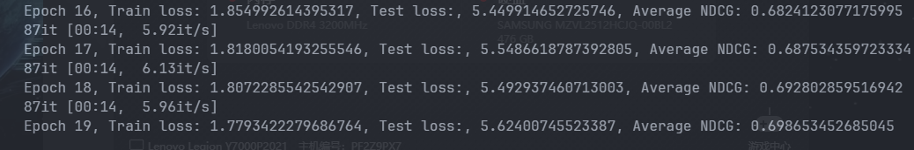

自选二：使用 `GraphRec` 的算法：（运行太慢了，且效果和 MF 差不多，弃用）

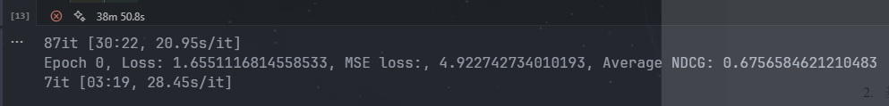

> 如果 `tqdm` 报错，执行命令：`pip install ipywidgets`(但是进度条还是不显示，不过无所谓)；如果 `ConnectTimeoutError`，需要科学上网。

##### 学习Pytorch

[60分钟快速入门 PyTorch - 知乎 (zhihu.com)](https://zhuanlan.zhihu.com/p/66543791)

### 改代码

#### 数据预处理

##### 处理 Tags

保留用户评价，加入到 Tag 中，需要去重。

相关代码如下：

```python
# Tag 数据集
# 读tag_data取保存的 CSV 文件
tag_data = pd.read_csv('../data/selected_movie_top_1200_data_tag.csv')
# 引入用户评价数据
rating_data = pd.read_csv('../data/movie_score.csv')
# 删除 NaN 的行
rating_data.dropna(inplace=True)
# 将用户打的 Tag 加入到 tag_data['Tags'] 中
tag_data['Tags'] = tag_data['Movie'].map(rating_data.groupby('Movie')['Tags'].apply(list).to_dict())
# 对于每一行 Tags，将其转换为一整个字符串
tag_data['Tags'] = tag_data['Tags'].apply(lambda x: ','.join(x))
# 拆分为列表，去重，去除空字符串，'|', '...' 等无意义的 Tag
tag_data['Tags'] = tag_data['Tags'].apply(lambda x: list(set(x.split(','))))
tag_data['Tags'] = tag_data['Tags'].apply(lambda x: list(filter(lambda x: x not in ['', '|', '...'], x)))
# 保存为 CSV 文件
tag_data.to_csv('../res/selected_tags.csv', index=False)
print(tag_data)
```


##### 处理 Users

有些用户的评分数据大部分是 0，参考价值不大（一般人也不会打 0 分(可能)），考虑将评分为 0 的数据删掉。注意还要去掉评分数据太少的用户（因为有的用户基本评的都是 0）

相关代码如下：

```python
# User 数据集
# 读user_data取保存的 CSV 文件
user_data = pd.read_csv('../data/movie_score.csv')
# 去除评分为 0 的行
user_data = user_data[user_data['Rate'] > 0]
# 去除评价数据过少的用户
user_data = user_data.groupby('User').filter(lambda x: len(x) > 10)
# 去除不必要的列
user_data = user_data[['User', 'Movie', 'Rate']]
# 保存为 CSV 文件
user_data.to_csv('../res/selected_users.csv', index=False)
print(user_data)
```

运行结果：

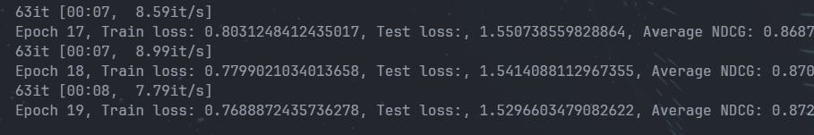

可以看到，数据量变少之后运行速度显著提升，预测效果也变好了很多。由此可见数据预处理的重要性，原始数据可能有很多无用且干扰判断的信息。

#### 模型优化

##### 加入bias

考虑到有的用户比较苛刻，打分偏低，有的用户比较宽容，打分偏高。为每个用户和每个电影加入一些偏置元素bu 和 bi，代表了他们自带的与其他事物无关的属性，融入了这些元素，才能区别且正确地对待每一个用户和每一个物品，才能在预测中显得更加个性化。

相关代码如下：

```python
# 定义模型，引入 Item User 偏置提高效果
class MF(nn.Module):
    def __init__(self, num_users, num_movies, embedding_dim, init_std = 0.1):
        super(MF, self).__init__()
        self.user_embedding = nn.Embedding(num_users, embedding_dim)
        self.movie_embedding = nn.Embedding(num_movies, embedding_dim)
        self.user_bias = nn.Embedding(num_users, 1)
        self.movie_bias = nn.Embedding(num_movies, 1)
        nn.init.normal_(self.user_embedding.weight, std = init_std)
        nn.init.normal_(self.movie_embedding.weight, std = init_std)
        nn.init.normal_(self.user_bias.weight, std = init_std)
        nn.init.normal_(self.movie_bias.weight, std = init_std)
        
    def forward(self, user, movie):
        user_embedding = self.user_embedding(user)
        movie_embedding = self.movie_embedding(movie)
        user_bias = self.user_bias(user)
        movie_bias = self.movie_bias(movie)
        dot = (user_embedding * movie_embedding).sum(1)
        return dot + user_bias.squeeze() + movie_bias.squeeze()
```

运行结果如下：

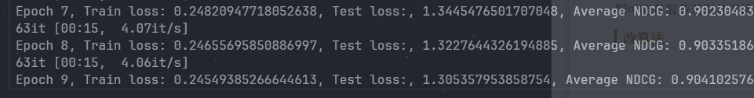

可以看到，优化效果还是比较明显的，平均 `NDCG` 已经达到了 0.9
