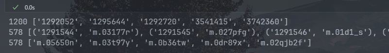
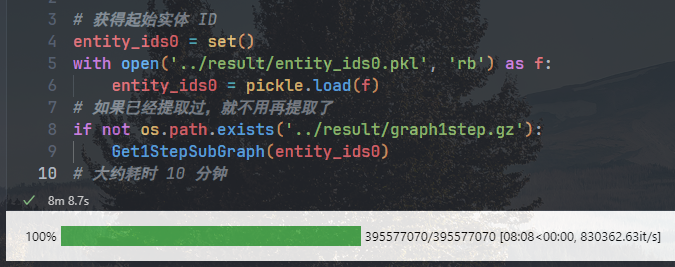
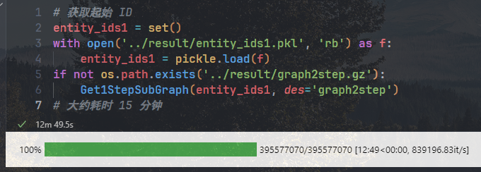
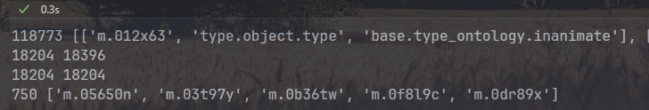
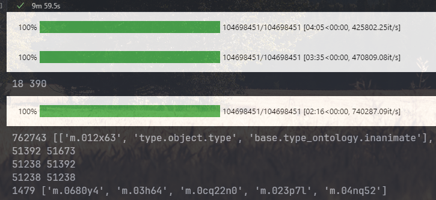
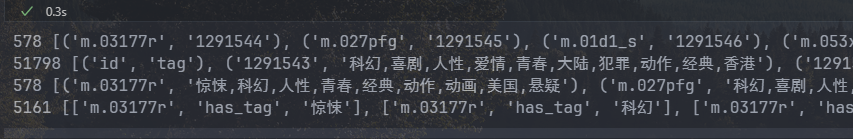
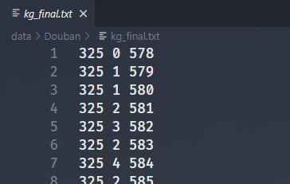

# 实验报告

> 注：由于本实验有些数据文件非常大，为了方便，我们上交的压缩包中删除了不必要的 `pycache` 文件夹和一些大文件，如助教有需要可以联系我们提供。

## 实验目标

1. 从公开图谱 `freebase` 中匹配指定电影对应的实体，并抽取合适的部分图谱
2. 基于对实验一中的豆瓣电影评分数据，结合 part1 所获得的图谱信息，进行可解释的、知识感知的个性化电影推荐

## Part1

首先根据电影 ID 到实体 ID 的映射表，得到抽取子图的起点实体。直接读取文件匹配即可，要注意的是，映射表文件格式不统一，有的是 `\t` 分隔，有的是空格，需要处理一下。代码如下：

```python
# 读取 id 列表
movie_ids = []
with open('../data/Movie_id.csv', 'r') as f:
    reader = csv.reader(f)
    for row in reader:
        movie_ids.append(row[0])
print(len(movie_ids), movie_ids[:5])
# 读取映射表，txt 文件
entity_movie_map = {}
with open('../data/douban2fb.txt', 'r') as f:
    for line in f:
        # 将 \t 替换成空格
        line = line.replace('\t', ' ')
        line = line.strip().split(' ')
        entity_movie_map[line[0]] = line[1]
print(len(entity_movie_map), list(entity_movie_map.items())[:5])
# 得到实体 ID
entity_ids = set()
for movie_id in movie_ids:
    # 只保留有映射的
    if movie_id in entity_movie_map:
        entity_ids.add(entity_movie_map[movie_id])
print(len(entity_ids), list(entity_ids)[:5])
```

运行结果如下图：



### 抽取子图

然后定义一个抽取子图的函数 `Get1StepSubGraph()`，该函数从图谱中抽取以参数 `entity_ids` 为起点实体的所有三元组，并将结果压缩存储在 `des` 参数指定的文件中（因为数据量较大）。代码如下：

```python
# 以 entity_ids 为起点生成一跳子图，保存到 des.gz 文件中
def Get1StepSubGraph(entity_ids, des='graph1step'):
    with gzip.open('../result/' + des + '.gz', 'wb') as ans:
        with gzip.open('../data/freebase_douban.gz', 'rb') as f:
            for line in tqdm(f, total=395577070):
                line = line.strip()
                triplet = line.decode().split('\t')[:3]
                # 排除前缀不是 http://rdf.freebase.com/ns/ 的实体
                if (triplet[0][:28] != '<http://rdf.freebase.com/ns/') \
                    or (triplet[1][:28] != '<http://rdf.freebase.com/ns/') \
                    or (triplet[2][:28] != '<http://rdf.freebase.com/ns/'):
                    continue
                # 保存起点在 entity_ids 中的三元组
                if triplet[0][28:-1] in entity_ids:
                    ans.write(line + b'\n')
```

> 这里我为了格式统一，也把前缀不是 `<http://rdf.freebase.com/ns/` 的关系筛掉了，影响不大

简单调用此函数即可获得一跳或二跳子图。结果如下：





### 筛选子图

下面定义筛选子图的函数，实现从给定的三元组集合中筛选出出现次数大于 `limit` 次的实体和关系。先遍历一遍三元组计数，然后直接筛选即可，代码如下：

```python
# 从 triplets 中筛选出度大于 limit 的实体
def Select(entity_ids0, triplets, entity_limit=20, relation_limit=50):
    entity_count = {}
    relation_count = {}
    # 计数
    for triplet in triplets:
        if triplet[0] not in entity_count:
            entity_count[triplet[0]] = 0
        entity_count[triplet[0]] += 1
        if triplet[1] not in relation_count:
            relation_count[triplet[1]] = 0
        relation_count[triplet[1]] += 1
        if triplet[2] not in entity_count:
            entity_count[triplet[2]] = 0
        entity_count[triplet[2]] += 1
    # 筛选
    ans = []
    for triplet in triplets:
        # 要不就是在 entity_ids0 中，要不就是度大于 limit
        if (triplet[0] in entity_ids0 or entity_count[triplet[0]] > entity_limit) \
        and (relation_count[triplet[1]] > relation_limit) \
        and (triplet[2] in entity_ids0 or entity_count[triplet[2]] > entity_limit):
            ans.append(triplet)
    return ans
```

这里有一个参数 `entity_ids0`，表示一定要保留的实体（即最开始的 578 个起点实体）。

#### 筛选一跳子图

由于一跳子图规模比较小，所以可以先将三元组存储到列表中，再调用筛选函数筛选。由于实体数量和关系数量互相影响，所以需要多次调用直至收敛。代码如下：

```python
# 读取一跳子图
triplets = []
with gzip.open('../result/graph1step.gz', 'rb') as f:
    for line in f:
        line = line.strip()
        triplet = line.decode().split('\t')[:3]
        triplet = [triplet[0][28:-1], triplet[1][28:-1], triplet[2][28:-1]]
        triplets.append(triplet)
print(len(triplets), triplets[:5])
# 筛选至收敛
triplets_selected = Select(entity_ids0, triplets)
while len(triplets_selected) < len(triplets):
    triplets = triplets_selected
    triplets_selected = Select(entity_ids0, triplets)
    print(len(triplets_selected), len(triplets))
# 保存 ID
entity_ids = set()
for triplet in triplets_selected:
    entity_ids.add(triplet[0])
    entity_ids.add(triplet[2])
print(len(entity_ids), list(entity_ids)[:5])
```

运行结果如下：



可以看到，实体数量 750 个，三元组数量 18204 个。与文档给出的结果基本相符

#### 筛选二跳子图

由于二跳子图规模已经非常大了，所以暴力筛选会爆内存。需要在读文件的同时先粗筛一遍得到较小规模的三元组，再调用筛选函数筛选。具体操作是，先过滤掉出现超过 2w 次的实体（很可能是普遍的，无效的实体）和不超过 50 的关系；再筛选出出现次数超过 16 （15 的结果有点小多，所以设置为 16）次的实体和超过 50 次的关系。代码如下：

```python
if not os.path.exists('../result/graph2step_selected.gz'):
    # 读取两跳子图
    with gzip.open('../result/graph2step.gz', 'rb') as f:
        entity_count = {}
        relation_count = {}
        # 计数
        for line in tqdm(f, total=104698451):
            line = line.strip()
            triplet = line.decode().split('\t')[:3]
            triplet = [triplet[0][28:-1], triplet[1][28:-1], triplet[2][28:-1]]
            if triplet[0] not in entity_count:
                entity_count[triplet[0]] = 0
            entity_count[triplet[0]] += 1
            if triplet[1] not in relation_count:
                relation_count[triplet[1]] = 0
            relation_count[triplet[1]] += 1
            if triplet[2] not in entity_count:
                entity_count[triplet[2]] = 0
            entity_count[triplet[2]] += 1
        # ！只能边读边筛选，不然内存会爆掉
        f.seek(0)
        remove_entity = set()
        remove_relation = set()
        for line in tqdm(f, total=104698451):
            line = line.strip()
            triplet = line.decode().split('\t')[:3]
            triplet = [triplet[0][28:-1], triplet[1][28:-1], triplet[2][28:-1]]
            # 过滤出现大于 20000 的实体
            if entity_count[triplet[0]] > 20000:
                remove_entity.add(triplet[0])
            if entity_count[triplet[2]] > 20000:
                remove_entity.add(triplet[2])
            # 过滤出现小于 50 的关系
            if relation_count[triplet[1]] <= 50:
                remove_relation.add(triplet[1])
        print(len(remove_entity), len(remove_relation))
        # 筛选
        f.seek(0)
        for line in tqdm(f, total=104698451):
            line = line.strip()
            triplet = line.decode().split('\t')[:3]
            triplet = [triplet[0][28:-1], triplet[1][28:-1], triplet[2][28:-1]]
            if triplet[0] in remove_entity or triplet[1] in remove_relation or triplet[2] in remove_entity:
                continue
            triplets.append(triplet)
    print(len(triplets), triplets[:5])
    # 筛选至收敛
    triplets_selected = Select(entity_ids0, triplets, entity_limit=16, relation_limit=50)
    while len(triplets_selected) < len(triplets):
        triplets = triplets_selected
        triplets_selected = Select(entity_ids0, triplets, entity_limit=16, relation_limit=50)
        print(len(triplets_selected), len(triplets))
```

> 值得注意的是，第一跳得到的的 750 个实体中存在超过 2w 次的实体，不能保留。且必须按补充文档分两步筛选。否则筛选出的结果规模会大很多。这点困扰了我很久，多亏助教提醒

运行结果如下：



得到实体 1479 个，三元组 51238 个，与文档结果基本相符。经过检验，也包含了初始的 578 个实体。

### 添加 Tag

先通过电影 ID 到实体 ID 的映射和电影 ID 到 Tag 的映射建立实体 ID 到 Tag 的映射，简单读文件建字典即可，代码如下：

```python
# 建立实体 ID 到电影 ID 的映射
entity_movie_map = {}
with open('../data/douban2fb.txt', 'r') as f:
    for line in f:
        line = line.replace('\t', ' ')
        line = line.strip().split(' ')
        entity_movie_map[line[1]] = line[0]
print(len(entity_movie_map), list(entity_movie_map.items())[:5])
# 建立电影 ID 到 Tag 的映射，编码为 utf-8
movie_tag_map = {}
with open('../data/Movie_tag.csv', 'r', encoding='utf-8') as f:
    reader = csv.reader(f)
    for row in reader:
        movie_tag_map[row[0]] = row[1]
print(len(movie_tag_map), list(movie_tag_map.items())[:5])
# 建立实体 ID 到 Tag 的映射
entity_tag_map = {}
for entity_id in entity_movie_map:
    movie_id = entity_movie_map[entity_id]
    if movie_id in movie_tag_map:
        entity_tag_map[entity_id] = movie_tag_map[movie_id]
print(len(entity_tag_map), list(entity_tag_map.items())[:5])
```

由于 Tag 数据都是电影分类，本身语义已经够简洁，基本没有语义相似的重复项，无需实体对齐。所以考虑直接将 Tag 拆分为一个个关键词实体，与含有 Tag 的实体 ID 建立三元组链接即可。代码如下：

```python
# 在三元组中加入 Tag
triplets = []
with gzip.open('../result/graph2step_selected.gz', 'rb') as f:
    triplets = []
    for line in f:
        line = line.strip()
        triplet = line.decode().split('\t')[:3]
        triplet = [triplet[0][28:-1], triplet[1][28:-1], triplet[2][28:-1]]
        triplets.append(triplet)
new_triplets = []
for entity_id in entity_tag_map:
    tags = entity_tag_map[entity_id].split(',')
    for tag in tags:
        new_triplets.append([entity_id, 'has_tag', tag])
print(len(new_triplets), new_triplets[:5])
triplets += new_triplets
# 保存到文件
with gzip.open('../result/FinalGraph.gz', 'wb') as f:
    for triplet in triplets:
        # 不要前缀了
        f.write(('\t'.join(triplet) + '\n').encode())
```

运行结果如下：



可以看到，新增了 5161 个三元组，对应实体为电影和 Tag，关系定义为 `has_tag`。由于前缀没有什么用，所以这里最后存储时直接把前缀去掉了。

## Part2

### 索引映射

> 对应代码位置： `data_loader/loader_map.py`

目标是为每个实体和关系赋予一个唯一的索引值作为 ID。

首先读取 `douban2fb.txt` 文件，建立电影 ID 到实体 ID 的字典，然后再通过 `movie_id_map.txt`，为 578 个电影实体赋予索引值。相关代码如下：

```python
# 先获得电影 ID 到实体 ID 的映射关系
movie_entity_map = {}
with open('data/douban2fb.txt', 'r') as f:
    for line in f:
        # 格式不统一，有的 \t 有的空格
        line = line.replace('\t', ' ')
        line = line.strip().split(' ')
        movie_entity_map[line[0]] = line[1]
entity_id_map = {}
with open('data/movie_id_map.txt', 'r') as f:
    lines = f.readlines()
    for line in lines:
        # 将每一行按照空格分割
        line = line.strip().split()
        # 将电影实体的ID 映射到[0, num of movies)范围内
        entity_id_map[movie_entity_map[line[0]]] = int(line[1])
```

然后根据 part1 获得的知识图谱，为剩下的实体和关系赋予 ID。代码如下：

```python
# 打开 FinalGraph.gz，读取所有三元组
import gzip
triples = []
with gzip.open('data/FinalGraph.gz', 'r') as f:
    lines = f.readlines()
    for line in lines:
        line = line.strip()
        triplet = line.decode().split('\t')[:3]
        triples.append(triplet)
# 将图谱中的其余实体映射到[num of movies, num of entities)范围内
entity_id = len(entity_id_map)
for triplet in triples:
    if triplet[0] not in entity_id_map:
        entity_id_map[triplet[0]] = entity_id
        entity_id += 1
    if triplet[2] not in entity_id_map:
        entity_id_map[triplet[2]] = entity_id
        entity_id += 1
# 将关系映射到[0, num of relations)范围内
relation_id_map = {}
relation_id = 0
for triplet in triples:
    if triplet[1] not in relation_id_map:
        relation_id_map[triplet[1]] = relation_id
        relation_id += 1
```

最后将三元组保存到 `kg_final.txt` 文件中，值得注意的是，这里三元组必须用空格分隔，否则后面读取会出错。代码如下：

```python
# 将第一阶段获得的电影图谱映射为由索引值组成的三元组
triples_id = []
for triplet in triples:
    triplet_id = [entity_id_map[triplet[0]], relation_id_map[triplet[1]], entity_id_map[triplet[2]]]
    triples_id.append(triplet_id)
# 保存到 \data\kg_final.txt 文件中
with open('data/Douban/kg_final.txt', 'w') as f:
    for triplet_id in triples_id:
        # 用空格分割，不然后面读取的时候会出错
        f.write(str(triplet_id[0]) + ' ' + str(triplet_id[1]) + ' ' + str(triplet_id[2]) + '\n')
```

得到 `kg_final.txt` 的内容如下图所示：



### 图谱嵌入

#### 数据加载

> 对应代码位置：`data_loader/loader_Embedding_based.py`

主要有两个任务，一是考虑到 part1 限制了起始实体必须为头实体，而实际上如果有三元组 `(h,r,t)`，一般会有对应的三元组 `(t,r',h)`，所以添加逆向三元组丰富语义。注意要更新三元组数量等相关参数。相关代码如下：

```python
# 得到逆向三元组 (t, r+n_relations, h)
n_relations = len(set(kg_data['r']))
temp = kg_data.copy()
temp['r'] += n_relations
kg_data_reverse = temp[['t', 'r', 'h']]
# 拼接为新的DataFrame
self.kg_data = pd.concat([kg_data, kg_data_reverse], ignore_index=True)
# 计算关系数，实体数和三元组的数量
self.n_relations = n_relations * 2
self.n_entities = len(set(self.kg_data['h']) | set(self.kg_data['t']))
self.n_kg_data = len(self.kg_data)
```

二是遍历所有三元组，构建两个字典，分别为 `{h:(t,r)}` 和 `{r:(h,t)}`，便于后面将图谱嵌入到模型中。代码如下：

```python
self.kg_dict = collections.defaultdict(list)
self.relation_dict = collections.defaultdict(list)
# 遍历所有三元组
for h, r, t in zip(self.kg_data['h'], self.kg_data['r'], self.kg_data['t']):
    self.kg_dict[h].append((t, r))
    self.relation_dict[r].append((h, t))
```

#### 模型搭建

##### TransE

`TransE` 算法认为，三元组的嵌入向量应该满足三角关系，即 $\vec{h}+\vec{r}=\vec{t}$，下面是相关概念原理介绍：

- 正采样和负采样的三元组：从知识图谱中随机选择一个正例三元组，其中包括头部实体、关系和尾部实体。同时，抽样一个被损坏的三元组，头部和关系与正例相同，但尾部是一个随机选择的不属于真实关系的实体。
- 目标距离优化：通过调整头部、关系和尾部的嵌入向量，使得真实尾部和被损坏尾部之间的距离小于头部加关系和被损坏尾部之间的距离。也就是说，希望通过学习找到一种表示方式，使得**真实的三元组在嵌入空间中更接近，而被损坏的三元组则更远离**。

因此，我们的优化目标是让负样本的距离尽可能大于正样本，距离体现在代码中就是得分。

首先需要对实体或关系嵌入进行 `L2` 范数归一化，然后分别计算正负样本的得分(欧几里得距离)，最后计算并返回 `loss` 值。值得注意的是，因为 `kg_loss` 是张量，所以需要求出均值再返回，否则后面会报错。相关代码如下：

```python
# 5. 对关系嵌入，头实体嵌入，尾实体嵌入，负采样的尾实体嵌入进行L2范数归一化
r_embed = F.normalize(r_embed, p=2, dim=1)
h_embed = F.normalize(h_embed, p=2, dim=1)
pos_t_embed = F.normalize(pos_t_embed, p=2, dim=1)
neg_t_embed = F.normalize(neg_t_embed, p=2, dim=1)
# 6. 分别计算正样本三元组 (h_embed, r_embed, pos_t_embed) 和负样本三元组 (h_embed, r_embed, neg_t_embed) 的得分
pos_score = torch.norm(h_embed + r_embed - pos_t_embed, p=2, dim=1, keepdim=False)
neg_score = torch.norm(h_embed + r_embed - neg_t_embed, p=2, dim=1, keepdim=False)
# 7. 使用 BPR Loss 进行优化，尽可能使负样本的得分大于正样本的得分
kg_loss = (-1.0) * torch.log(1e-10 + F.sigmoid(pos_score - neg_score))
# 注意：这里的 kg_loss 是一个向量，需要对其求均值
kg_loss = torch.mean(kg_loss)
```

##### TransR

`TransR` 算法是将实体和关系分别映射到两个空间中，然后将实体空间中的实体通过转移矩阵 $M_r$ 转移到关系空间中进行向量表示，在 `TransR` 算法中，每一个三元组的实体向量被设定为一个 k 维向量，关系向量被设为一个 d 维向量，k可以不等于d，而映射矩阵则为一个 k*d 的矩阵，这样在从实体空间转移到关系空间之后，每个头实体和尾实体都变成了关系空间中的向量表示。

嵌入过程类似，相关代码如下：

```python
def calc_kg_loss_TransR(self, h, r, pos_t, neg_t):
    r_embed = self.relation_embed(r)
    W_r = self.trans_M[r]
    h_embed = self.entity_embed(h)
    pos_t_embed = self.entity_embed(pos_t)
    neg_t_embed = self.entity_embed(neg_t)
    # 1. 计算头实体，尾实体和负采样的尾实体在对应关系空间中的投影嵌入
    r_mul_h = torch.bmm(h_embed.unsqueeze(1), W_r).squeeze(1)
    r_mul_pos_t = torch.bmm(pos_t_embed.unsqueeze(1), W_r).squeeze(1)
    r_mul_neg_t = torch.bmm(neg_t_embed.unsqueeze(1), W_r).squeeze(1)
    # 2. 对关系嵌入，头实体嵌入，尾实体嵌入，负采样的尾实体嵌入进行L2范数归一化
    r_embed = F.normalize(r_embed, p=2, dim=1)
    r_mul_h = F.normalize(r_mul_h, p=2, dim=1)
    r_mul_pos_t = F.normalize(r_mul_pos_t, p=2, dim=1)
    r_mul_neg_t = F.normalize(r_mul_neg_t, p=2, dim=1)
    # 3. 分别计算正样本三元组 (h_embed, r_embed, pos_t_embed) 和负样本三元组 (h_embed, r_embed, neg_t_embed) 的得分
    pos_score = torch.norm(r_mul_h + r_embed - r_mul_pos_t, p=2, dim=1, keepdim=False)
    neg_score = torch.norm(r_mul_h + r_embed - r_mul_neg_t, p=2, dim=1, keepdim=False)
    # 4. 使用 BPR Loss 进行优化，尽可能使负样本的得分大于正样本的得分
    kg_loss = (-1.0) * torch.log(1e-10 + F.sigmoid(pos_score - neg_score))
    kg_loss = torch.mean(kg_loss)
    l2_loss = _L2_loss_mean(r_mul_h) + _L2_loss_mean(r_embed) + _L2_loss_mean(r_mul_pos_t) + _L2_loss_mean(r_mul_neg_t)
    loss = kg_loss + self.kg_l2loss_lambda * l2_loss
    return loss
```

##### 图谱嵌入

可以通过相加、逐元素乘积、拼接等方式为物品嵌入注入图谱实体的语义信息。这里以直接相加为例，后面会比较不同嵌入方式的性能。相关代码如下：

```python
# 直接将物品嵌入和实体嵌入相加
item_pos_cf_embed = item_pos_embed + item_pos_kg_embed
item_neg_cf_embed = item_neg_embed + item_neg_kg_embed
pos_score = torch.sum(user_embed * item_pos_cf_embed, dim=1)
neg_score = torch.sum(user_embed * item_neg_cf_embed, dim=1)
cf_loss = (-1.0) * torch.log(1e-10 + F.sigmoid(pos_score - neg_score))
cf_loss = torch.mean(cf_loss)
```

### 对比分析

##### 不同注入方式

实验结果如下表：

| 注入方式 | Precision[@5, @10] | Recall[@5, @10]  | NDCG[@5, @10]    |
| -------- | ------------------ | ---------------- | ---------------- |
| 相加     | [0.3002, 0.2523]   | [0.0669, 0.1122] | [0.3159, 0.2841] |
| 相乘     | [0.2837, 0.2494]   | [0.0621, 0.1095] | [0.2944, 0.2734] |
| 拼接     | [0.3105, 0.2653]   | [0.0684, 0.1183] | [0.3261, 0.2969] |

可以看到，直接拼接的效果最好。因为直接拼接不会扰乱各自的原语义，而且向量维度变大了，能表示的语义更丰富，模型效果更好。

##### TransR vs TransE

分别采用 `TransR` 算法和 `TransE` 算法得到图谱嵌入，然后将图谱嵌入与物品嵌入直接相加，实验结果如下表：

| 嵌入算法 | Precision[@5, @10] | Recall[@5, @10]  | NDCG[@5, @10]    |
| -------- | ------------------ | ---------------- | ---------------- |
| TransE   | [0.3002, 0.2523]   | [0.0669, 0.1122] | [0.3159, 0.2841] |
| TransR   | [0.2864, 0.2532]   | [0.0651, 0.1119] | [0.3003, 0.2796] |

可以看到，在本实验中，`TransR` 的效果还没有 `TransE` 好，推测可能是因为 TransR 算法的关系矩阵会将多对一和一对多关系的向量映射到同一个空间，导致语义信息丢失。

##### KG or not

将普通的 `MF` 模型和带有图谱嵌入的模型（`TransE` + 直接相加）相比较，结果如下：

| 模型 | Precision[@5, @10] | Recall[@5, @10]  | NDCG[@5, @10]    |
| ---- | ------------------ | ---------------- | ---------------- |
| MF   | [0.2966, 0.2532]   | [0.0660, 0.1094] | [0.3110, 0.2829] |
| KG   | [0.3002, 0.2523]   | [0.0669, 0.1122] | [0.3159, 0.2841] |

可以看到，带有图谱嵌入的模型效果略好。因为图谱嵌入丰富了物品向量的语义。
